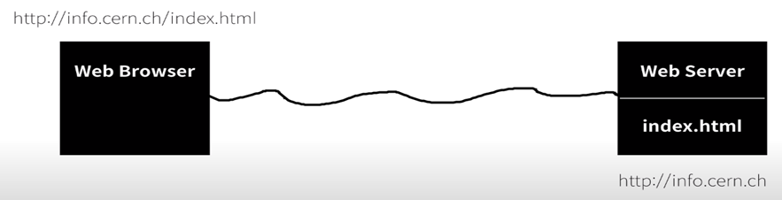

<h1>👽인터넷은 어떻게 동작하는가?</h1>

 인터넷이 동작하기 위해서 컴퓨터는 최소 몇대가 필요할까요? 팀버너스리는 2개의 컴퓨터를 준비해서 한대는 Web Browser를 설치하고 다른 한대에는 Web Server 를 설치하고 인터넷으로 연결했다. 

 

웹브라우저에서 http://info.cern.ch/index.html 를 입력하면 이 정보는 인터넷을 통해 웹서버로 전해지면 웹서버의 하드디스크에 있는 index.html파일을 불러와 웹 브라우저가 있는 컴퓨터로 인터넷을 통해 전송한다 

 웹브라우저를 사용해서 정보를 요청하는 쪽을 클라이언트 ( client ) 라고 부르고 정보를 제공하는 쪽을 서버라고 부른다.

<h2> http://192.168.0.25</h2>

 
Internet Protocol Address : 약속된 주소, 전세계의 유일한 주소, (도메인 주로 사용)   
http : Hyper Text Transfer Protocol : 웹페이지를 주고 받기 위한 통신규약  
내 컴퓨터 ip 알아보기:  cmd -> ipconfig  

